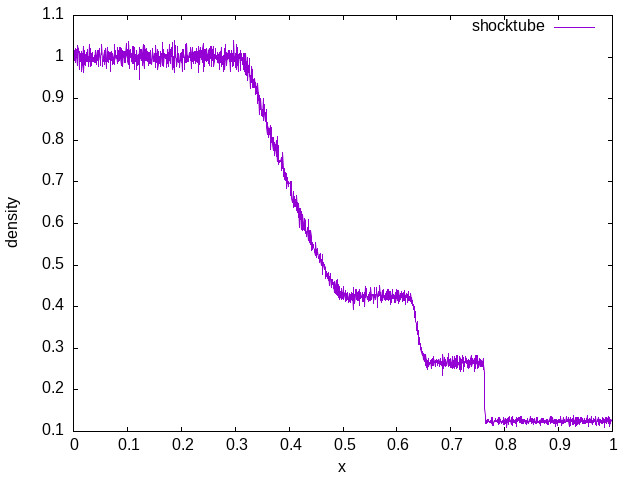
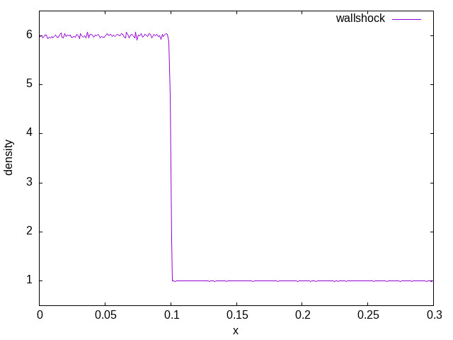
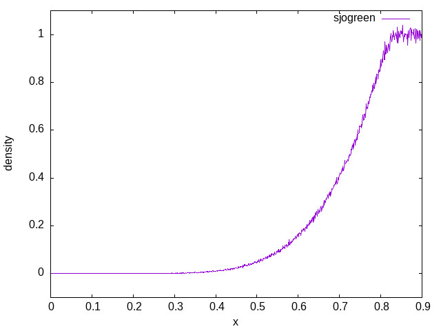
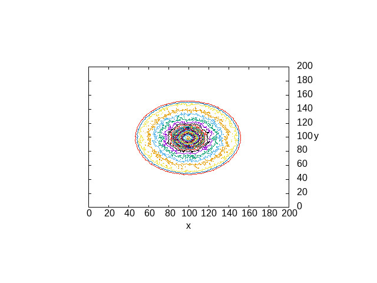

# BPH-GPU

Boltzmann Particle Hydrodynamics (BPH) on GPU, written in Rust on top of
[massively](https://github.com/akiradeveloper/massively) and
[CubeCL](https://github.com/tracel-ai/cubecl).

This repository is a reimplementation of
[bphcuda](https://github.com/akiradeveloper/bphcuda), which was originally
developed as my master's work.  The goal is to keep the BPH algorithmic model
while rebuilding the GPU parallel primitives around `massively`.

## What Is BPH?

BPH stands for Boltzmann Particle Hydrodynamics.  It is a Monte Carlo particle
method for hydrodynamics:

1. Divide space into Cartesian cells.
2. Move particles freely during each time step.
3. Sort/group particles by cell.
4. Relax each cell stochastically toward a local thermodynamic equilibrium
   while conserving mass, momentum, and energy.

Because particles are Lagrangian and may cross many cells in one step, BPH is
an explicit scheme that is not restricted by the usual CFL condition.  It also
preserves positive density and pressure, supports arbitrary ratios of specific
heats through internal degrees of freedom, and parallelizes naturally over many
particles and cells.

The trade-off is statistical fluctuation: useful simulations need many
particles, so GPU memory and parallel throughput matter.

For more background, see:

- `bph.pdf` in this repository.
- [Boltzmann Particle Hydrodynamics (Dr. Matsuda)](https://www.cps-jp.org/modules/mosir/player.php?v=20111027_matsuda)
- [An Engineering Application of BPH Method (Dr. Isaka)](https://www.cps-jp.org/modules/mosir/player.php?v=20111027_isaka)

## Repository Layout

- `bph-gpu/` - the reusable BPH GPU library crate.
- `experiments/shocktube/` - Sod shock tube benchmark.
- `experiments/wallshock/` - wall shock benchmark.
- `experiments/sjogreen/` - Sjogreen rarefaction benchmark.
- `experiments/noh/` - 2D Noh implosion benchmark.
- `workspace/draw/` - plotting scripts for generated data.
- `workspace/plot/` - checked-in result plots.

## Implementation Notes

The core simulation loop follows the same high-level structure across the
experiments:

1. Allocate particle state arrays on a CubeCL executor.
2. Initialize positions, velocities, mass, and internal energy.
3. Compute cell indices from particle positions.
4. Sort particles by cell using `massively::sort_by_key`.
5. Apply the BPH relaxation step with `bph_gpu::bph`.
6. Stream particles with a first-order Runge-Kutta update.
7. Apply benchmark-specific boundary conditions and output derived quantities.

The library keeps reusable GPU operations under `bph-gpu/src/tool/` and
algorithmic primitives such as reduction and bucket counting under
`bph-gpu/src/algorithm/`.

## Requirements

- Rust with edition 2024 support.
- A CubeCL-supported backend.  The examples currently create a WGPU executor
  with `cubecl::wgpu::WgpuDevice::DefaultDevice`.
- Ruby and Rake only if you want to regenerate the checked-in plots through
  `workspace/Rakefile`.

Dependencies on `massively` and `cubecl` are pinned in `Cargo.toml`.

## Quick Start

Build the workspace:

```sh
cargo build
```

Run tests:

```sh
cargo test
```

Run a small shock tube example:

```sh
cargo run -p shocktube -- 500 100 2 0.15
```

Write benchmark data to a file:

```sh
cargo run -p shocktube -- 500 1000 2 0.15 --out workspace/dat/shocktube.dat
```

The common experiment arguments are:

- `n` - particles per cell, or the per-cell particle scale used by the
  benchmark.
- `m` - number of cells, or the spatial resolution scale.
- `s` - internal degrees of freedom parameter used by BPH relaxation.
- `fin` - final simulation time.
- `--out` - optional output path for post-processing.

`sjogreen` also takes an additional `u0` velocity argument.

## Reproducing Plots

From the `workspace/` directory, use the Rake tasks:

```sh
cd workspace
rake shocktube
rake wallshock
rake sjogreen
rake noh
```

Or run every benchmark and redraw every plot:

```sh
cd workspace
rake all
```

The generated images are written under `workspace/plot/`.

## Results

This implementation has been checked against standard shock-hydrodynamics
benchmarks: Sod shock tube, wall shock, Sjogreen rarefaction, and Noh
implosion.

### Shock Tube

[Sod shock tube](https://en.wikipedia.org/wiki/Sod_shock_tube)



### Wall Shock



### Sjogreen



### Noh



## License

MIT
